# SpaceX App

[](https://flutter.dev)
[](https://opensource.org/licenses/MIT)

Mobile application built with Flutter that allows space enthusiasts to explore the history of SpaceX launches.
Track past and present launches, get technical details of rockets, launchpads and payloads, and keep your favorite missions just a tap away.

---

## ✨ Feature Showcase

###  Onboarding

<table align="center">
  <tr>
    <td align="center">
      
    </td>
    <td align="center">
      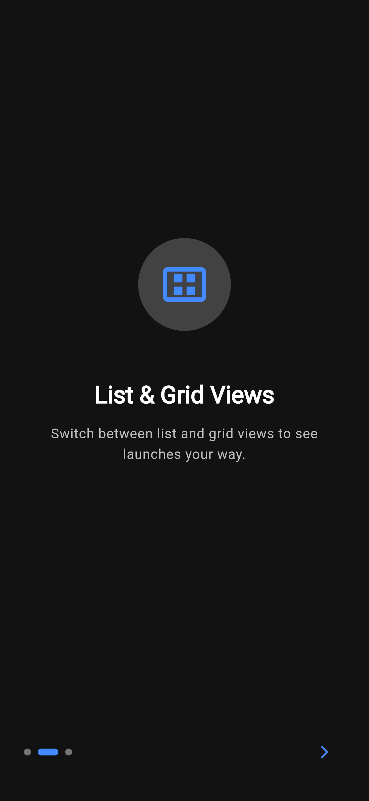
    </td>
    <td align="center">
      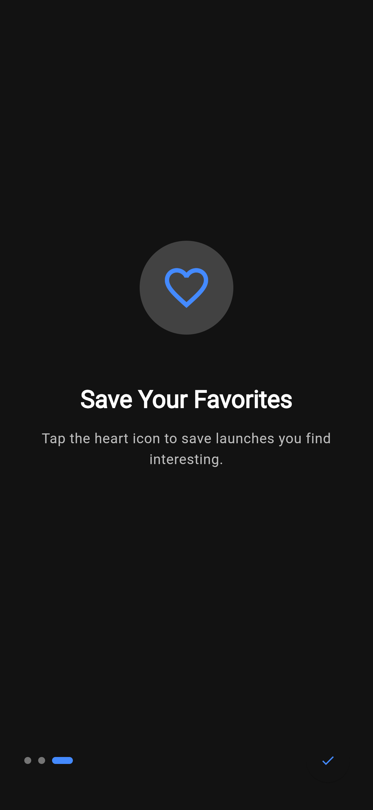
    </td>
  </tr>
</table>

---

### Pinned Favorites

<div align="center">
      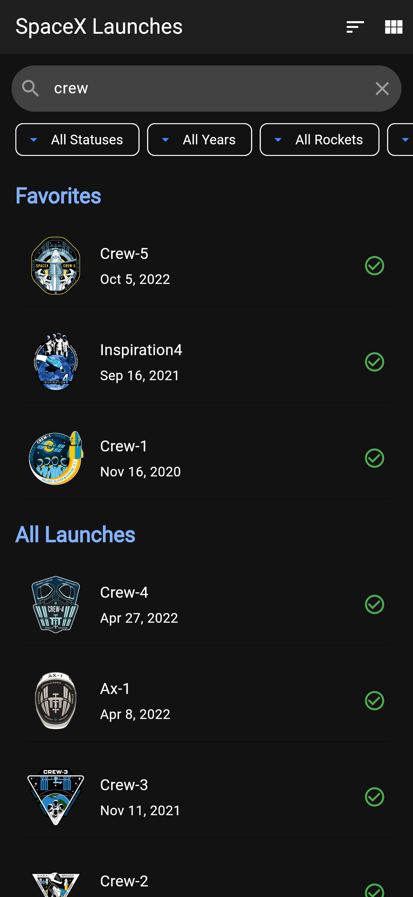
</div>

---

### Grid/List view mode

<table align="center">
  <tr>
    <td align="center">
      
    </td>
    <td align="center">
      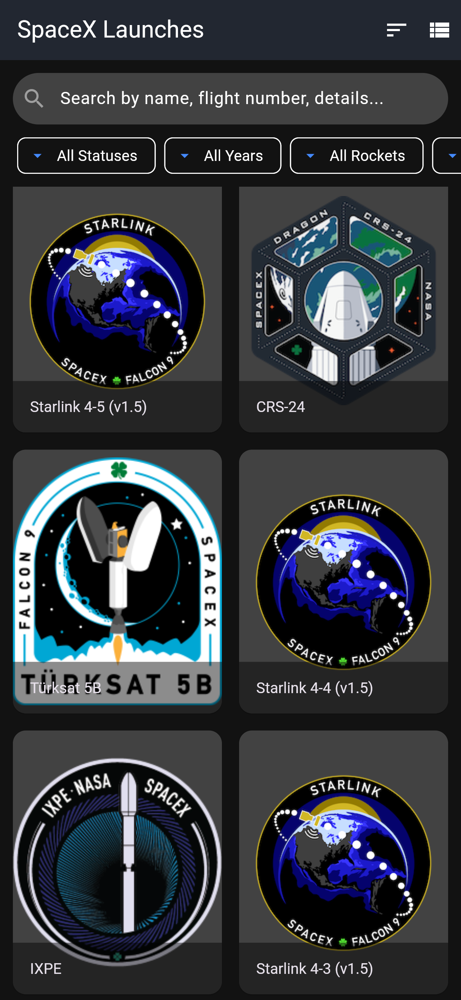
    </td>
  </tr>
</table>

---

### Search

<table align="center">
  <tr>
    <td align="center">
      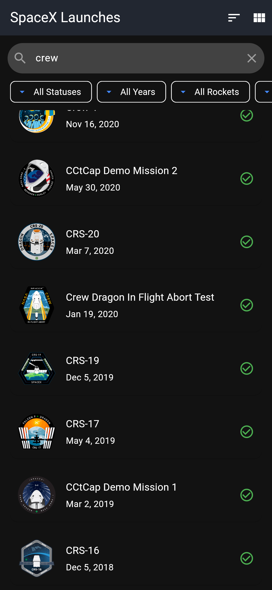
    </td>
    <td align="center">
      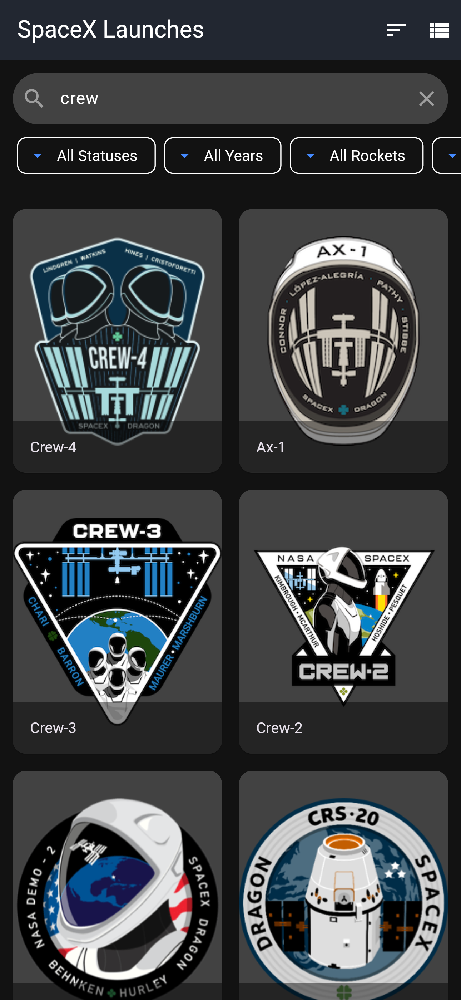
    </td>
  </tr>
</table>

---

### Filter

<div align="center">
      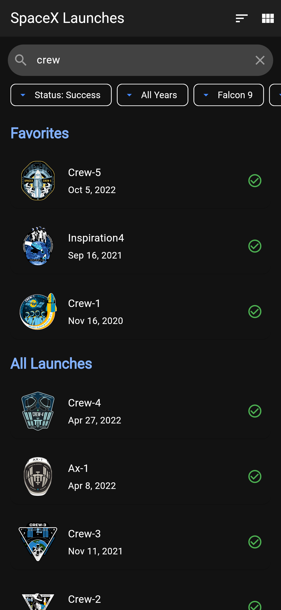
</div>

---

### Details

<table>
  <tr>
    <td align="center">
      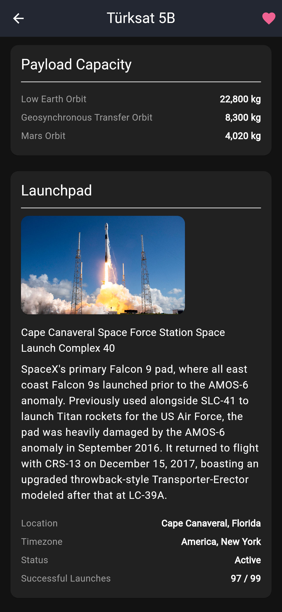
    </td>
    <td align="center">
      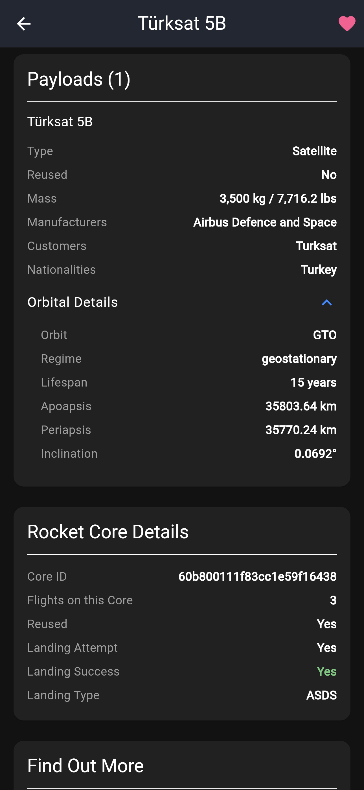
    </td>
    <td align="center">
      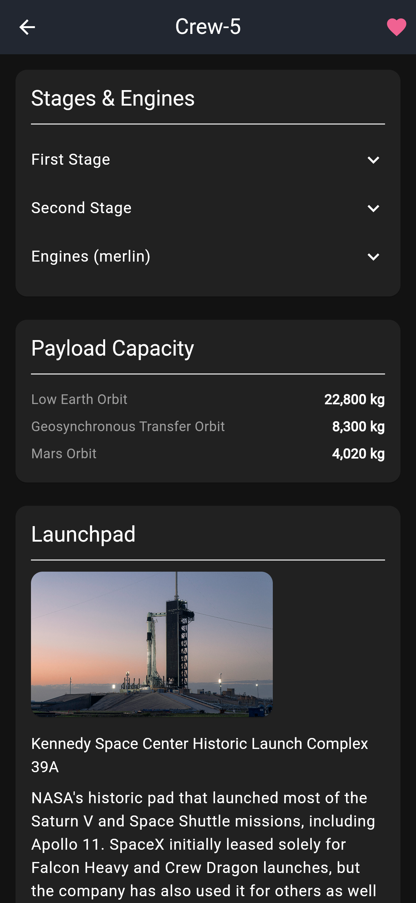
    </td>
    <td align="center">
      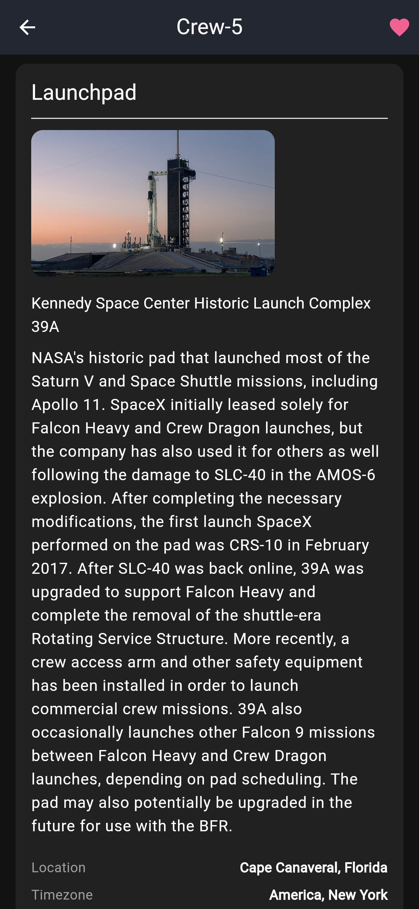
    </td>
    <td align="center">
      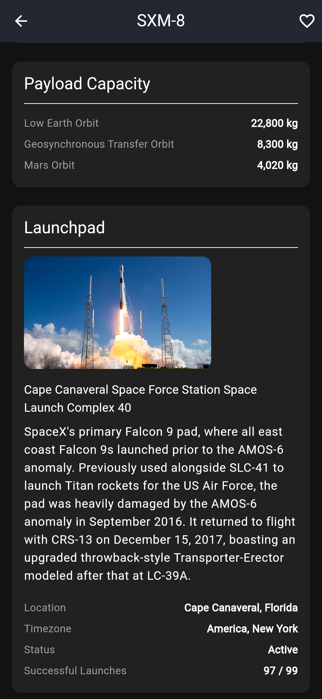
    </td>
    <td align="center">
      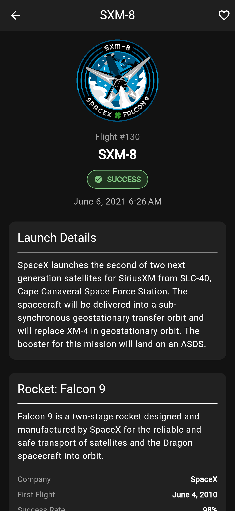
    </td>
    <td align="center">
      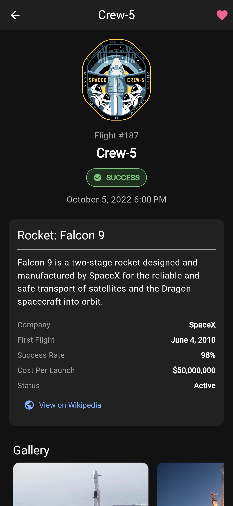
    </td>
  </tr>
</table>

---

### Image galleries

<table align="center">
  <tr>
    <td align="center">
      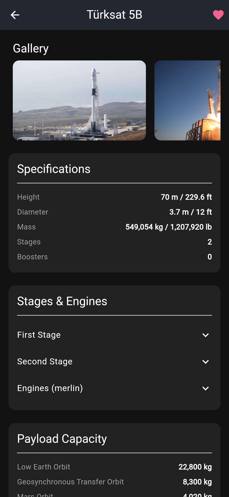
    </td>
    <td align="center">
      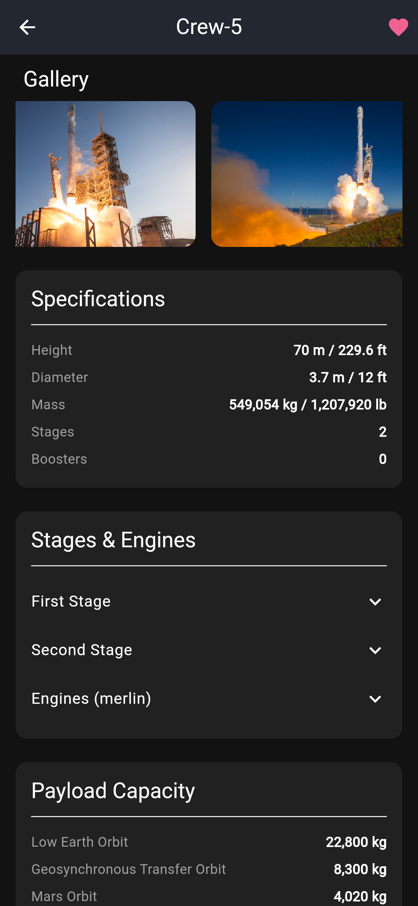
    </td>
  </tr>
</table>

---

## 🛠️ Technical Stack & Architecture

This application is built with a focus on clean, scalable, and maintainable code, following modern best practices.

- **State Management:** `flutter_bloc` (using Cubit) for predictable and decoupled state management.
- **Architecture:** clean architecture separating presentation and data.
- **Data Modeling:** robust, type-safe models using `json_serializable` and `build_runner`.
- **Networking:** `http` package for making API calls to the [SpaceX API](https://github.com/r-spacex/SpaceX-API).
- **UI Design:** implements principles of Atomic Design for maximum widget reusability.
- **Local Storage:** `shared_preferences` for persisting user favorites and onboarding status.

## 🚀 Getting Started

To run this project locally, follow these steps:

1.  **Clone the repository:**
    ```sh
    git clone https://github.com/maxbodin/spacex_app.git
    cd spacex_app
    ```

2.  **Install dependencies:**
    ```sh
    flutter pub get
    ```

3.  **Run the code generator:**
    (Required after any changes to model files)
    ```sh
    flutter pub run build_runner build --delete-conflicting-outputs
    ```

4.  **Run the app:**
    ```sh
    flutter run
    ```

## 📄 License

This project is licensed under the MIT License - see the [LICENSE.md](LICENSE.md) file for details.